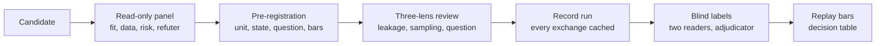

# Jev for sava and GLAM: lessons learned

Written 2026-09-18 at the end of the evaluation. `findings.md` beside this file is the
evidence, experiment by experiment; this is the distilled version for anyone deciding
whether and how to use a model of this kind. The handoff plan for the sava-build agent is
`JEV_HANDOFF.md` in the sava-build repository.

## What Jev is and what it costs

Jev 1.13 answers narrow typed questions about a text state with calibrated probabilities in
about 0.3 s, at $0.042 per million input tokens, and writes no text. All five experiments
together sent 2,834 requests and cost 15 cents; the real cost was design and labeling time.

- **Three primitives.** Choice (up to 255 described options; returns a choice, probabilities,
  and a confidence), Score (2 to 10 ordered levels; returns a probability-weighted mean), Noul
  (a yes/no probability). Many questions over one state run in parallel in one request, about
  12 times cheaper than one question per request.
- **Limits.** 64k tokens for state plus questions, 32k for the state plus the longest
  question. Text or JSON only.
- **Documented weaknesses, all confirmed.** It reads instructions literally, cannot count or
  compare dates, is distracted by irrelevant state, does not treat state as hostile, and
  rarely abstains.
- **What that forced on every design.** Code computes every fact it can (which identifiers
  are present, how many implementors exist, whether a cited line falls inside a body) and Jev
  judges only what prose says against the code shown. Every question carries a `question`, a
  `focus`, and a `data` field that fences quoted text as data.
- **Constraints we set ourselves.** Only public repositories are sent as state. The key lives
  in the shell environment, never in a repository. Jev proposes, code and humans dispose:
  nothing gates a build, accepts a mutant, or edits a file.
- **Client.** TypeSafe ships Python and JavaScript SDKs and no Java one, so the fleet now has
  `sava-software/typesafe-client`, a Java client built to sava-build conventions with a
  recording decorator that keys every response by the hash of its request.

## How we evaluated it

Every experiment went through the same pipeline, and the pipeline mattered more than any
single result.

- **Panels before code.** Two adversarial rounds (36 and 16 read-only reviewers) rejected
  eight obvious candidates and two adjacent ones before any request, each with a file-cited
  reason. The pattern: in this fleet the label is usually computable from structure, the
  volume is small, or the judgment needs cross-file reasoning.
- **Pre-registration.** Unit, state, question text, deterministic baselines, bars, and a
  first-match-wins decision table were written to the plan file before the first request.
  Reviews amended designs, also before the first request; the D review produced 15 findings
  and 14 stood.
- **Recorded exchanges.** The client's recording decorator keys each response by the SHA-256
  of the request body, so a replay is free, needs no key, and re-renders byte for byte.
- **Blind labels.** Two Claude Opus readers per row from the request state alone, never a
  response or a report, a third deciding disagreements. Agreement before adjudication: 105 of
  109 (A), 172 of 178 (B), 30 of 30 (C2), 144 of 150 (C1), 70 of 76 (D). Each label carries
  the reader's one-line reason and can be overwritten by hand.
- **Baselines and kill rules.** Every run reports the deterministic features that could
  explain the score (length, size, overlap, one-bit structural flags) and kills on a proxy
  correlation above 0.8.
- **Mutation testing of the harness.** PIT over the experiment code found a state-assembly
  bug (the declaration spanning a row's line hint sorted last) that moved C2 from kill to
  keep after 164 rows were re-scored. Both numbers are recorded.

## Results at a glance

| experiment | question asked of Jev | rows | decisive number | bar | verdict | cost |
| --- | --- | --- | --- | --- | --- | --- |
| A, acceptance-note rot | does the code shown still contain the construct this paragraph names | 109 labeled | all 10 rotted notes in the top 30% by P(absent); 4 that the identifier check cannot see | recall >= 0.90 | keep | $0.007 |
| B, finding dedupe | same defect, narrowed, or restated | 178 pairs | three-level rule: recall 0.40 at confidence >= 0.8; two-way rule: precision 1.000, recall 0.832 | precision >= 0.95 at recall >= 0.70 | keep the two-way question | $0.023 |
| C2, evidence mis-filing | does this paragraph's reasoning address this mutant in this member | 644 | AUROC 0.855 real versus swapped; 8 of the top 30 confirmed mis-filed | AUROC >= 0.85, >= 5 confirmed | keep | $0.083 |
| C1, doc comment wrong at HEAD | does this comment stand consistent with, contradicted by, or unchecked by this code | 461 + 150 sample | AUROC 0.663 swapped versus real; 3 of 124 contradicted in the fleet, ranked 96th, 143rd, 150th | AUROC >= 0.85 | kill | $0.028 |
| D, comment needs updating at change time | what does this change do to the claims in this comment | 76 | AUROC 0.594 co-edit versus body-only; oracle ceiling of the label 0.660 | interval lower bound >= 0.75 | kill | $0.010 |

Ten candidates were rejected before any request; their reasons are in `findings.md`.

## What Jev is good at here

- **Construct presence in prose against code.** Asked whether the code shown still contains
  the branch, loop, guard, or call a paragraph names, it put every one of the ten rotted
  acceptance notes in the top 30% of 109, including four with no missing identifier for a
  regex to catch. The deterministic check alone finds six at precision 0.18.
- **Does this argument address this change.** Over 644 hardening rows it separated a
  paragraph's real mutant from a swapped one at 0.855, and its `cannot_tell` landed on the
  provenance paragraphs that argue nothing, which is the right answer for them. Eight real
  mis-filings sat in its top 30.
- **Same defect or different.** On review-workflow findings it is sharp on "different" (15
  of 17 at the bottom level, none merged) and groups the rest at precision 1.000 and recall
  0.832. The three-level version failed because "narrowed" and "restated" are not a
  partition to a literal reader.
- **Ranking against a human-shaped label, even where the experiment failed.** In D, scored
  against the blind readers rather than the author's behaviour, it reached 0.80 and put all
  six comment updates the authors had forgotten in its top 30 of 47. That is post hoc and
  rests on 19 positives, but it is the reason a follow-up is worth pre-registering.
- **Speed and cost.** 1,232 judgments for eight cents in a few minutes. Batching questions
  over one state works as advertised.
- **Usable calibration.** Confidence below 0.6 is a useful "read this first" flag; the
  reports pin those rows to the top.

## Where it failed, and why

- **The label, not the model, was the wall in D.** Readers marked only 13 of 29 co-edited
  comments as actually affected by the body change; the rest were touch-ups made in the same
  commit for other reasons. A judge that agreed with the readers on every row would score
  0.66 against a bar of 0.75. History does not label drift in this fleet.
- **Literal reading turned one instrument inside out.** In C1 a sibling's comment over this
  member's body read as "not checkable" rather than "contradicted", because a comment about
  another method makes no claim this body can settle. Scored on the option it did use, the
  same run separates the arms at 0.90. The score was not moved after the fact; the design
  was killed and the lesson recorded.
- **Rare, subtle positives do not surface.** About one documented member in forty carries a
  comment its body contradicts, and the three found were subtle (`len > Long.BYTES` where
  the comment says eight or more). Jev ranked them 96th, 143rd, and 150th of 461.
- **It over-calls rather than abstains.** `cannot_resolve` fired on 2 of 110 rot rows;
  `needs_addition` was chosen for 20 of 57 rows readers called unaffected, the literal
  reading of "adds a behaviour the comment would need to describe" applied to any added
  line. Expect roughly one false alarm per real catch near the top of a ranked list.
- **A Noul whose premise is always true is uninformative.** "This argument depends on code
  not shown" scored above 0.5 on 99 of 110 rows, because every mutation note depends on a
  test that is not shown.
- **Structural leaks ride along.** A comment paraphrasing its member's name (0.75), an
  interface method gaining a default body (0.72), member length (0.77): each would have
  passed as signal without a two-sided baseline. The batched file mode in D mostly read
  which member's name appeared in the changes (0.87 on that alone).

## Lessons about running experiments with a probability model

1. **Write the bar and the decision table before the first request.** Twice the result
   landed within 0.005 of a bar (C2 passed by 0.005, the first C2 run failed by 0.006). The
   table is what kept those from becoming arguments.
2. **Two-sided deterministic baselines, always, and a proxy kill rule.** A one-sided
   baseline made D's lift bar vacuous in review; the amended seven baselines showed the
   strongest feature was member length. The model often rides a structural feature, and
   only a baseline shows it.
3. **Measure the label before trusting it.** A single shuffled blind sheet of every row in
   both classes gives an oracle ceiling before any value bar is read. D's entire outcome is
   in that one number.
4. **Options must partition and questions must be literal.** "Constructs the paragraph
   names", never "is the argument sound". "Same defect or different", never a three-level
   scale whose middle a literal reader cannot place.
5. **Move computed facts out of the state and into baselines.** C1's first state handed Jev
   the identifier facts the baseline measured; the review caught it. If code can compute it,
   Jev should not be asked about it.
6. **Content-addressed recordings make everything else cheap.** Re-labeling, replaying bars,
   fixing a harness bug and re-scoring 164 rows, and byte-identical re-renders all cost
   nothing after the first run.
7. **Review the design with distinct lenses, then refute the findings.** Every design
   changed materially before its run; leakage, sampling, and question wording each caught
   things the others did not.
8. **Mutation-test the harness.** A green test suite hid the C2 sort bug; PIT did not.
9. **Verify delegated claims independently.** Agent-reported PIT counts were re-measured on
   main after a shared worktree contaminated one run; corpora were re-extracted byte for
   byte before any number was written down.
10. **Batching is cheap but can change the question.** One request per file with a Noul per
    comment cost a third of the tokens and an eleventh of the requests, and answered "which
    member changed" instead of "which comment is affected". Filter candidates
    deterministically first, then ask the narrow question.
11. **Model-made labels are reproducible, not human.** Blind Opus readers agreed with each
    other on 92 to 100% of rows and their reasons sit beside the labels; any row can be
    overwritten, and the bars replay for free.

## What ships, what does not, and the next steps

**Ships, as advisory reports only, never gates:**

- `pitest<Suite>NoteRotReport`: every acceptance paragraph ranked by P(construct absent)
  beside the deterministic identifier flags. Measured: all rotted notes in the top 30%,
  about one false alarm per catch near the top.
- `pitest<Suite>NoteFitReport`: every accepted row ranked by P(the paragraph does not
  address this mutant). Measured: about one real mis-filing per three rows at the top.
- A two-way dedupe stage between a review workflow's finder and refuter phases: 30 refuters
  to 6 on the named workflow, no different-defect pair merged.

**Does not ship:** any doc-comment check, at HEAD or at change time. The deterministic
checks (parameter names, thrown types, referenced identifiers against the diff) cover the
part of the problem that exists.

**Found along the way, fix by hand:** six comments whose authors changed the code and not
the words, all one-line fixes: `SolanaJsonRpcWebsocket.escalateUnanswered` (still says the
connection is aborted here), `SolanaAccounts.stakeConfig` (still says deprecated),
`BaseJsonIterator.skipLiteral` (lost its refill path), `EpochInfoServiceImpl.checkCycle` (a
new null-sample return), `SolanaJsonRpcWebsocket.deferredBuild` and `startBuild` (new
in-flight registration and precondition throw). Also the acceptance note on
`Transaction.exceedsSizeLimit` ("the only implementation"; HEAD has three).

**Next steps:**

- Hand `JEV_HANDOFF.md` in sava-build to the sava-build agent: a published
  `typesafe-reports` module first, then opt-in per-suite report tasks run out of process on
  the project toolchain, then documentation, then the dedupe CLI.
- If drift detection is still wanted, pre-register D again with blind reader labels as the
  gold from the start and more history than six repositories provide.
- Manual: rotate the TypeSafe API key (it was pasted in a chat), merge the 0.1.0 release
  pull request, and have an organization owner grant the Release Please app access to the
  repository.

## Pointers

- Client and harness: `/Users/jim/src/typesafe-client` (`sava-software/typesafe-client`).
  Findings: `docs/findings.md`. Experiment outputs: `typesafe-evals/experiments/<name>/`
  (`report.md`, `rows.tsv`, `jev.tsv`, `labels.tsv`). Recordings:
  `typesafe-evals/recordings/<name>/`.
- Pre-registrations and outcomes: `/Users/jim/.claude/plans/typesafe-is-a-new-refactored-crown.md`.
- Handoff plan: `/Users/jim/src/sava-build/JEV_HANDOFF.md`.
- TypeSafe reference: `/Users/jim/docs/ai/typesafe/skills` (the vendor skill, v0.5.7) and
  `https://docs.typesafe.ai`.
